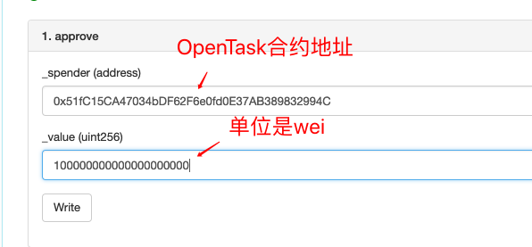
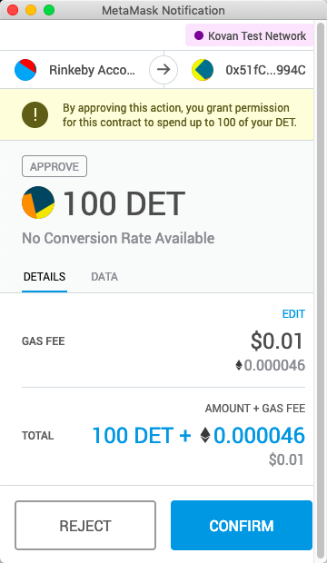
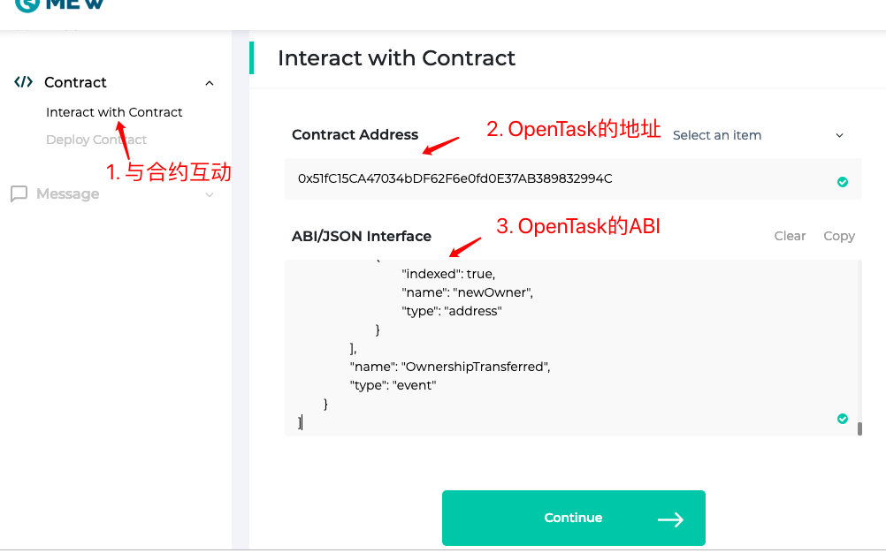
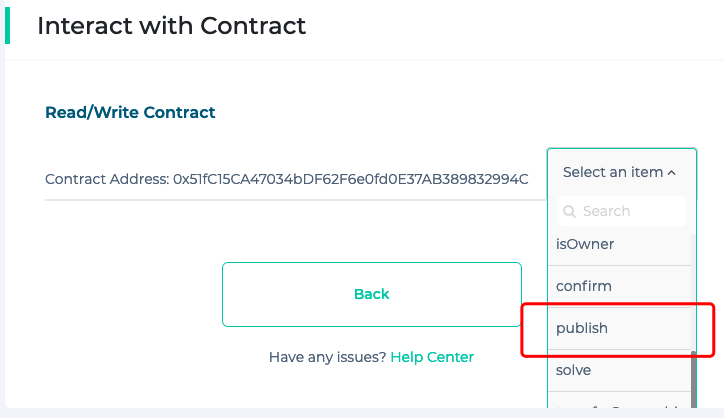
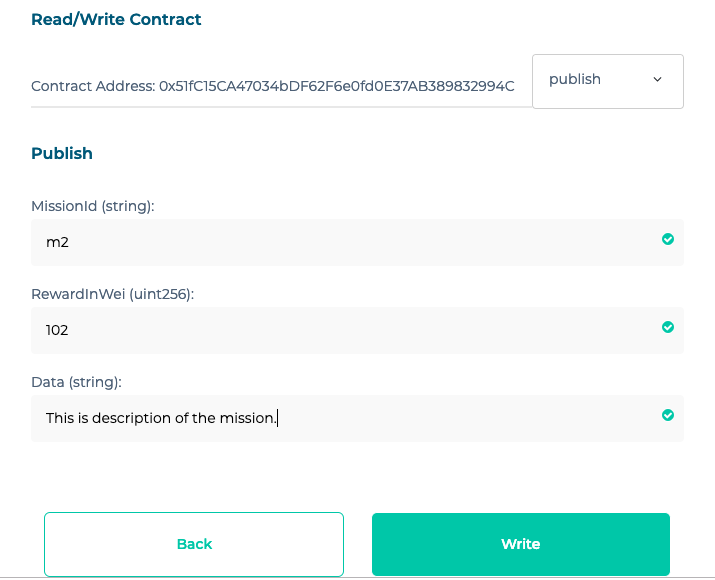

# 合约调试指南

## 整体流程

准备至少2个帐户，我们暂且称作 publisher 和 solver。

1. 使用publisher帐户调用DET合约，给OpenTask合约授权；
2. 使用publisher帐户调用OpenTask合约，发布任务；
3. 使用solver帐户调用OpenTask帐户，解决任务；
4. 如有必要，可重复 2 3 步骤；
5. 使用publisher帐户调用OpenTask帐户，接受或者拒绝解决方案；

以下，为手动验证的步骤演示，基于Kovan，演示中的合约地址为

- DET: `0x6ffF60A882CE1Cd793dC14261Eec0f0d6A470E21`
- OpenTask: `0xA3434f0ABAC66f46ABCf2E6c47488C00aA1980Cb`

## 1. Approve

使用publisher帐户调用DET合约，给OpenTask合约授权。

DET合约我们已经在Etherscan（<https://kovan.etherscan.io/address/0x6ffF60A882CE1Cd793dC14261Eec0f0d6A470E21#writeContract>）上验证过代码，因此可以直接调用Approve，如下

点击后，会弹出MetaMask的提示框，确认即可。

## 2. Publish

使用publisher帐户调用OpenTask合约，发布任务。

OpenTask合约不开源，因此想调用需要有ABI，可以同样使用Etherscan，也可以使用MyEtherWallet，以下是MyEtherWallet截图：

## 3. Solve

使用solver帐户调用OpenTask帐户，解决任务。

提交解决方案，和发布类似

## 4. Accept or Reject

使用publisher帐户调用OpenTask帐户，接受或者拒绝解决方案。

与以上步骤类似，调用对应接口即可。

**值得说明的是，如果第1步的Approve不成功，该步骤的Accept会失败。**
